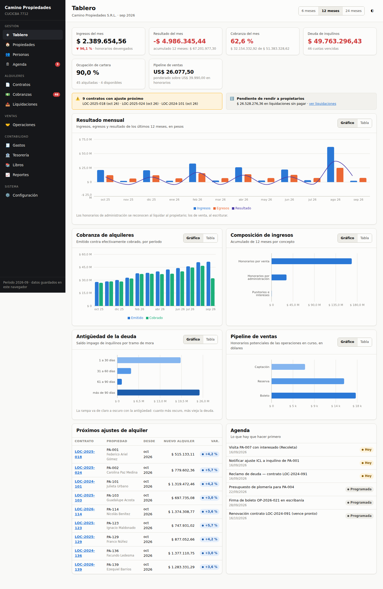

# Inmo Contable

Web app de **contabilidad y seguimiento para una inmobiliaria** que administra
alquileres e intermedia en ventas. Pensada para el mercado argentino: doble
moneda, actualización de alquileres por ICL/IPC/Casa Propia, punitorios por
mora, liquidaciones a propietarios y libro diario por partida doble.

Es **local-first**: no hay servidor ni cuentas. Los datos viven en el navegador
del usuario y se respaldan en un archivo JSON.



## Arrancar

```bash
npm install
npm run dev        # http://localhost:5173
```

Otros comandos:

| Comando | Qué hace |
|---|---|
| `npm run build` | Chequea tipos y compila a `dist/` (sitio estático) |
| `npm run preview` | Sirve `dist/` en http://127.0.0.1:4173 |
| `npm run typecheck` | Solo TypeScript |
| `npm run smoke` | Verificación de humo con Playwright (requiere `preview` levantado) |

### Publicarla en GitHub Pages

Ya está el workflow (`.github/workflows/deploy.yml`). Falta un solo paso a mano,
una única vez:

> **Settings → Pages → Build and deployment → Source: «GitHub Actions»**

Con eso, cada push compila y publica. La app usa rutas relativas y `HashRouter`,
así que anda igual en la raíz del dominio o en un subdirectorio, y no necesita
configuración de rewrites.

La primera vez la app se carga con una **inmobiliaria de demostración**
completa: 45 contratos de alquiler activos, 14 meses de cobranzas y
liquidaciones, operaciones de venta escrituradas y en curso, gastos y todo el
libro diario derivado. Desde **Configuración → Datos y respaldo** se puede
vaciar la base para empezar a cargar datos reales, o volver a la demo.

## Qué hace

| Módulo | Qué resuelve |
|---|---|
| **Tablero** | Ingresos, resultado, tasa de cobranza, morosidad, ocupación y pipeline, con series de 6/12/24 meses |
| **Propiedades** | Cartera con estado, destino, precios y vínculo al contrato vigente |
| **Personas** | Propietarios, inquilinos, compradores, garantes, agentes y proveedores (una persona puede tener varios roles) |
| **Contratos** | Alta, cronograma de actualizaciones y emisión de cuotas |
| **Cobranzas** | Grilla mensual, registro de pagos, punitorios calculados, antigüedad de deuda |
| **Liquidaciones** | Rendición a propietarios: cobrado menos honorarios menos gastos, con circuito borrador → aprobada → pagada |
| **Operaciones** | Pipeline de venta por etapa, honorarios y reparto entre agentes |
| **Gastos** | Gastos propios y gastos a recuperar del propietario, con IVA |
| **Tesorería** | Cuentas en pesos y dólares, saldos y libro de caja consolidado |
| **Libros** | Diario, mayor, sumas y saldos, estado de resultados y plan de cuentas |
| **Reportes** | Aporte por propiedad, morosidad, producción por agente, cartera por propietario, exportación CSV |
| **Agenda** | Tareas propias más los vencimientos que salen solos de los contratos |

## Las tres decisiones que explican el resto

**1. La plata del inquilino no es ingreso de la inmobiliaria.** Al emitir la
cuota nace un crédito contra el inquilino (`1.2.01`) y, por el mismo importe,
una deuda con el propietario (`2.1.01`). Recién al liquidar se reconoce el
honorario de administración como ingreso (`4.1.01`). Eso mantiene separados los
fondos de terceros del resultado propio, que es donde la mayoría de las
planillas de Excel se rompen.

**2. El alquiler vigente se calcula, no se guarda.** El contrato guarda el monto
inicial, el índice y cada cuántos meses ajusta. El cronograma sale de encadenar
los coeficientes del índice publicado. Cuando el BCRA publica el ICL definitivo
se carga en Configuración y todos los contratos se recalculan solos, incluidas
las proyecciones a futuro.


**3. Se liquida lo cobrado, y de a partes.** Cada ítem de liquidación guarda qué
fracción de la cuota está rindiendo. Si un inquilino pagó la mitad, se liquida
la mitad; cuando paga el resto, una liquidación complementaria toma la
diferencia. Generar liquidaciones dos veces no duplica nada.

Los detalles del modelo, el circuito contable completo y lo que falta para
producción están en [`docs/DISENO.md`](docs/DISENO.md).

## Cómo está armado

```
src/
├── domain/          Reglas del negocio, sin React ni almacenamiento
│   ├── types.ts         Modelo de datos
│   ├── util.ts          Fechas, períodos, dinero, formato es-AR
│   ├── contratos.ts     Cronograma de ajustes, índices, vigencia
│   ├── cobranzas.ts     Emisión de cuotas, punitorios, mora
│   ├── liquidaciones.ts Rendición a propietarios (incremental)
│   ├── ventas.ts        Honorarios, embudo, reparto entre agentes
│   ├── planCuentas.ts   Plan de cuentas y mapeos de imputación
│   ├── contabilidad.ts  Asientos automáticos, mayor, balance, resultados
│   └── reportes.ts      Series del tablero, tesorería, rentabilidad
├── data/            Persistencia y datos de demostración
├── components/      Kit de UI y gráficos
├── pages/           Una pantalla por módulo
└── styles/          Tokens de diseño y hoja principal
```

Todo lo que es cálculo vive en `domain/` como funciones puras sobre la base de
datos: son las que conviene tener cubiertas con tests y las que se mudan tal
cual el día que haya backend.

**Stack:** React 18 + TypeScript + Vite, Zustand para el estado, Recharts para
los gráficos, CSS propio con tokens. Sin framework de UI.

## Accesibilidad y presentación

- Modo claro y oscuro, cada uno con su propia paleta (no es un invertido
  automático). El interruptor está arriba a la derecha.
- La paleta de series está validada para daltonismo y contraste; el orden de
  colores es fijo y nunca se recicla por ranking.
- **Todo gráfico tiene su gemelo en tabla**: el color nunca es el único canal
  que transporta información.
- Las etiquetas de estado llevan siempre texto, no solo color.
- Responsivo hasta 390 px y con hoja de estilos de impresión para liquidaciones,
  fichas de contrato y libros.

## Límites conocidos

- **Un solo usuario, un solo navegador.** No hay login, permisos ni sincronización.
- **Los índices y la cotización se cargan a mano.** No hay integración con BCRA,
  INDEC ni AFIP.
- **No emite comprobantes fiscales.** No hay facturación electrónica ni libro IVA.
- **La demo es sintética.** Los índices y la serie del dólar son plausibles, no
  reales: hay que reemplazarlos antes de usar la app con datos de verdad.
