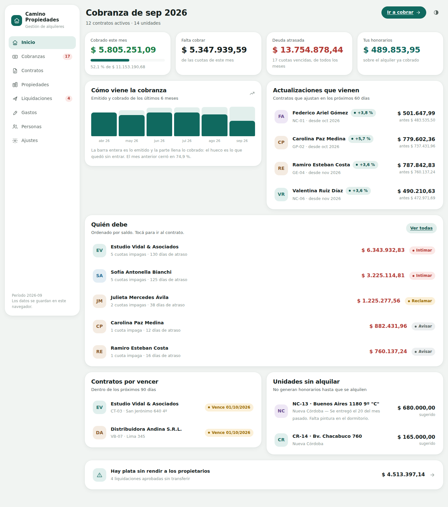
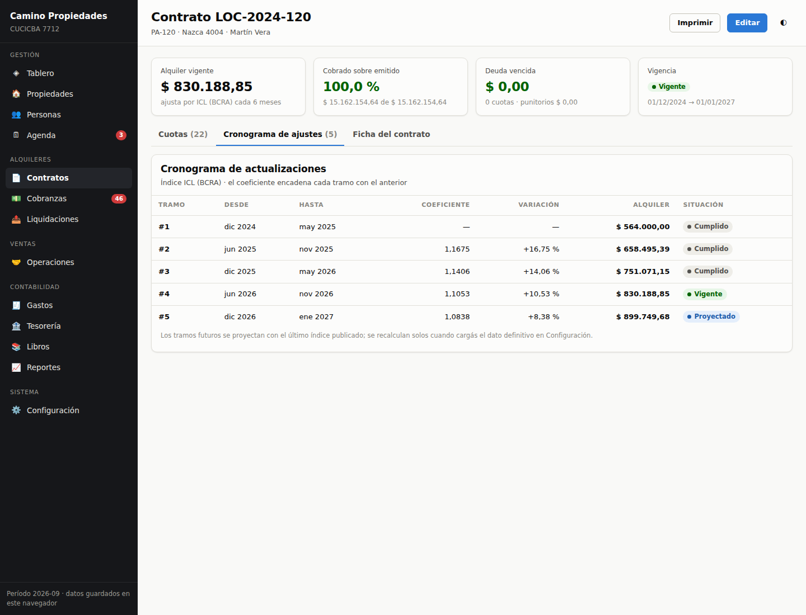
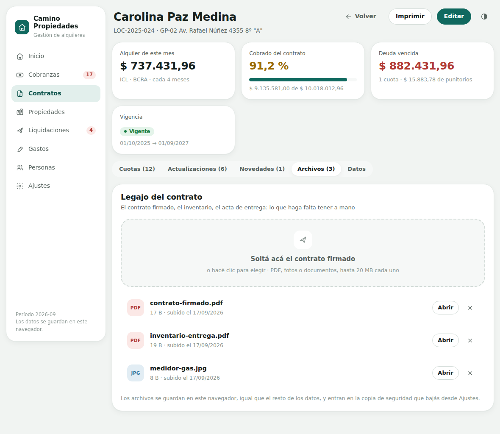
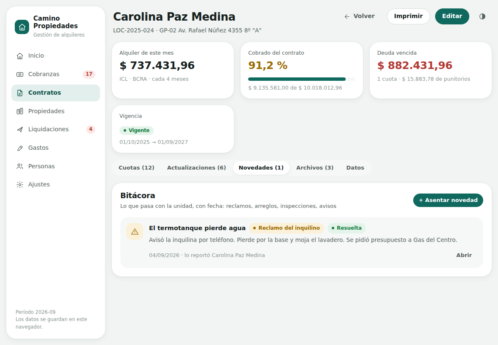
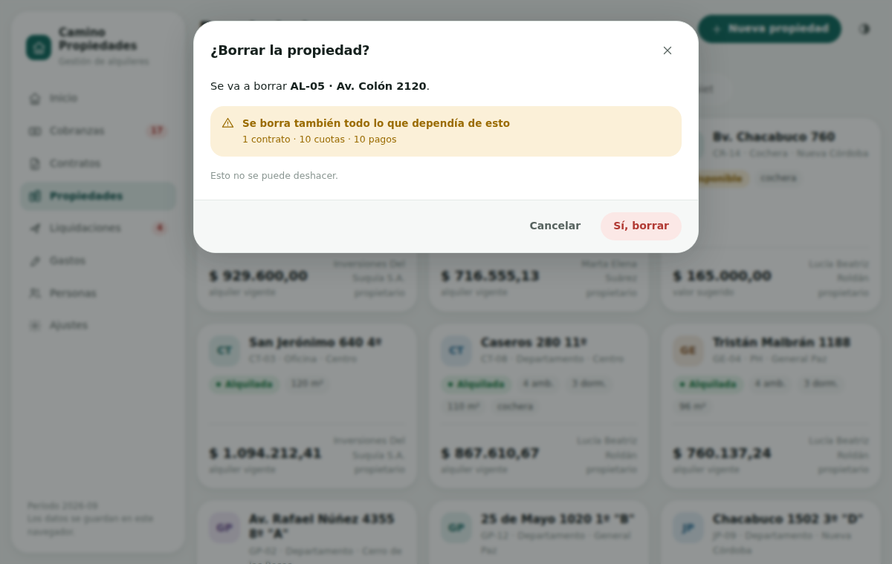

# Gestión de Alquileres

Web app para administrar alquileres: contratos, actualizaciones por índice,
cobranza mes a mes y liquidación a los propietarios. Pensada para Córdoba,
Argentina: incluye el **IPC de Córdoba** como índice de actualización, junto al
ICL del BCRA, el IPC nacional y el porcentaje fijo.

No hay servidor ni cuentas: los datos viven en el navegador y se respaldan en un
archivo.



## Arrancar

```bash
npm install
npm run dev        # http://localhost:5173
```

| Comando | Qué hace |
|---|---|
| `npm run build` | Chequea tipos y compila a `dist/` (sitio estático) |
| `npm run preview` | Sirve `dist/` en http://127.0.0.1:4173 |
| `npm run smoke` | Verificación de humo con Playwright (requiere `preview` levantado) |
| `npm run indices` | Trae el IPC de Córdoba publicado y actualiza `public/indices.json` |

Arranca con una administración de ejemplo: 14 unidades, 12 contratos activos, un
año de cobranzas y liquidaciones. Desde **Ajustes → Respaldo** se vacía para
cargar datos reales.

Ya está el workflow de GitHub Pages. Falta un solo paso a mano, una vez:
**Settings → Pages → Source: «GitHub Actions»**.

## Las pantallas

| Pantalla | Para qué |
|---|---|
| **Inicio** | Cuánto se cobró del mes, quién debe, qué contratos ajustan o vencen, qué unidades están vacías |
| **Cobranzas** | La cuota de cada inquilino del mes, con el botón de cobrar y los punitorios ya calculados |
| **Contratos** | Alta, cronograma de actualizaciones, cuotas, el legajo de archivos y la bitácora |
| **Propiedades** | La cartera, con su estado y el alquiler vigente |
| **Liquidaciones** | Lo que hay que transferirle a cada propietario: cobrado menos honorarios menos gastos |
| **Gastos** | Arreglos y servicios de cada unidad, para descontarlos de la liquidación |
| **Personas** | Propietarios, inquilinos y garantes |
| **Ajustes** | Tus datos, los índices mes a mes y el respaldo |

## Las decisiones que explican el resto

**El alquiler vigente se calcula, no se guarda.** El contrato guarda el monto
inicial, el índice y cada cuántos meses ajusta. El cronograma sale de encadenar
los coeficientes del índice publicado:

```
monto(k) = monto(k−1) × índice(períodoTramo k) / índice(períodoTramo k−1)
```

Cuando entra el dato definitivo del mes, todos los contratos que usan ese índice
se recalculan solos, incluidas las proyecciones a futuro.



**El índice es por contrato.** Si el contrato dice ICL, actualizar por IPC de
Córdoba no es válido. Cada contrato elige el suyo y la app respeta esa elección.

**Se liquida lo cobrado, y de a partes.** Cada ítem de liquidación guarda qué
fracción de la cuota está rindiendo. Si el inquilino pagó la mitad, se rinde la
mitad; cuando paga el resto, una liquidación complementaria toma la diferencia.
Apretar «Generar» dos veces no duplica nada.

**Los PDF no van en `localStorage`.** Guarda solo texto y el límite ronda los
5 MB para toda la base: un contrato escaneado ya lo revienta. Los binarios van a
IndexedDB y en la base principal queda nada más que la ficha del archivo. El
respaldo que bajás de Ajustes los lleva adentro, así que una copia no es una
copia a medias.



**La bitácora del contrato es la memoria de la unidad.** El inquilino avisa de
una filtración, se hace una inspección, se manda una intimación: queda asentado
con fecha, tipo y detalle, con fotos o presupuestos colgados. Lo que quedó
abierto aparece en Inicio, porque es lo primero que se olvida.



**Los honorarios salen del alquiler cobrado, no de la cuota entera.** Las
expensas se las lleva el consorcio: cobrarles comisión sería cobrar de más.

**Borrar arrastra lo que dependía.** La base es un objeto plano en el navegador,
sin claves foráneas: si el borrado filtrara una sola colección, las cuotas de un
contrato borrado seguirían contando para siempre. `domain/integridad.ts` es la
única fuente de verdad sobre qué depende de qué — corre después de cada borrado
y también al abrir la app, así repara sola cualquier base que haya quedado
inconsistente.

Antes de borrar hay confirmación, y dice cuánto se lleva puesto. Ese detalle se
calcula simulando el borrado con el mismo código que después lo ejecuta, así lo
que promete el cartel es exactamente lo que pasa.



## El IPC de Córdoba, actualizado solo

La app es un sitio estático. El navegador no puede pedirle los datos al organismo
—CORS, y el sitio puede estar caído justo cuando alguien abre la app— así que el
que consulta es GitHub Actions:

```
cron diario  →  scripts/actualizar-indices.mjs  →  public/indices.json  →  deploy
                (portal de datos abiertos                    ↓
                 de la Provincia de Córdoba)        la app lo lee al abrir
                                                    y lo mezcla con lo local
```

Si el organismo cambia el formato, el script **falla y no escribe nada**: el
workflow queda en rojo, que es mejor que publicar un índice mal leído. Y siempre
se puede corregir cualquier mes a mano desde Ajustes.

> **Estado:** el parseo todavía no se probó contra la fuente real — el entorno
> donde se escribió tiene bloqueado el dominio del organismo. La primera corrida
> en Actions va a mostrar exactamente qué devuelve el portal.

## Cómo está armado

```
src/
├── domain/          Las reglas, sin React ni almacenamiento
│   ├── types.ts         Modelo de datos
│   ├── util.ts          Fechas, períodos, plata, formato es-AR
│   ├── contratos.ts     Cronograma de ajustes, índices, vigencia
│   ├── cobranzas.ts     Emisión de cuotas, punitorios, mora
│   ├── liquidaciones.ts Rendición a propietarios (incremental)
│   └── resumen.ts       Los números de Inicio
├── data/            Persistencia, índices y datos de ejemplo
├── components/      Kit de interfaz e íconos
├── pages/           Una pantalla por sección
└── styles/          Tokens de diseño y hoja principal
```

Todo el cálculo vive en `domain/` como funciones puras sobre la base de datos.
Son las que conviene cubrir con tests y las que se mudan tal cual el día que haya
backend.

**Stack:** React 18 + TypeScript + Vite, Zustand, CSS propio con tokens. Sin
librería de componentes y sin librería de gráficos.

## Detalles de la interfaz

- Modo claro y oscuro, cada uno con su propia paleta. El interruptor está arriba
  a la derecha.
- Listas de tarjetas en vez de grillas: se lee como una app, no como una planilla.
- Los estados siempre llevan texto además de color.
- Anda hasta 390 px de ancho y tiene hoja de impresión para contratos y
  liquidaciones.

## Lo que no hace

- **Un solo usuario, un solo navegador.** No hay login ni sincronización.
- **No emite comprobantes fiscales** ni tiene libro IVA.
- **Los valores de índice que trae la demo son inventados** (plausibles, pero
  inventados). Hay que reemplazarlos antes de usarla en serio.
